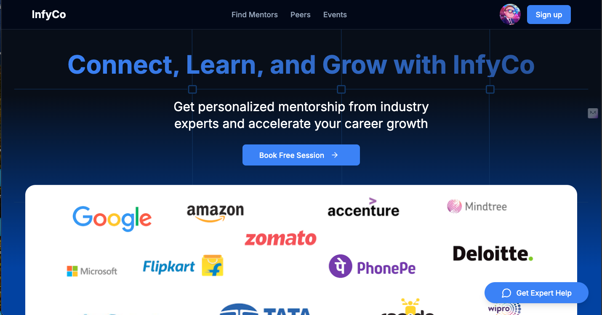

# Infyco Connect, Learn, and Grow

## Infyco is a modern mentorship platform designed to connect students with industry professionals and peers across various categories for career guidance and knowledge sharing. Empowering users to connect with mentors, track their learning, and grow in their careers.



Check out the live web app: [Infyco Live Demo](https://infyco.in/)


## Table of Contents
- [Installation](#installation)
- [Usage](#usage)
- [Features](#features)
- [Technologies Used](#technologies-used)
- [License](#license)
- [Author](#author)

## Installation

1. Clone the repository
```bash
git clone https://github.com/username/infyco.git
```
2. Install dependencies
```bash
npm install
```
3. Start development server
```bash
npm run dev
```

## Usage
- Wide Variety of Mentor Categories: Engineering, Data Science, Business, Design, Startup, Career Coaches, UPSC, Finance, etc.
- Mentor Sessions: Choose from different session types including 1:1 Mentorship, Resume Review, Project Assistance, Interview Preparation, and Job Referrals.
- Detailed Mentor Profiles: Each mentor profile includes their profile picture, current company, experience, skills, journey, and reviews.
- Booking Sessions: Select the mentor, choose a date and time for the session, and confirm the booking.
- Dashboard for Mentees: Track learning progress, upcoming sessions, and more.
- Chat Features: Chat with mentors and peers, and save liked mentors for future sessions.
- Peer Networking: A dedicated section for students to connect, chat, and discuss with each other.
- Event Management: College events, hackathons, jobs, and internships can be tracked through the Events Section.
- Create Events: Organize and create events directly on the platform, with location-based event discovery for hackathons, job fairs, and internships.
- Onboarding for Mentors & Mentees: Easy sign-up and sign-in process with a smooth onboarding flow for both mentors and mentees.
- Profile & Settings: Users can edit their profiles, access settings, manage messages, and track activity on the platform.
## Features
- Mentor discovery across a wide range of categories and fields.
- 1:1 mentorship, resume reviews, project assistance, interview preparation, and job referrals.
- Mentor profiles with detailed information including skills, journey, experience, and reviews.
- Booking system to select date and time for sessions.
- Dashboard for mentees to track progress and upcoming events.
- Peer chat for student connections and discussions.
- Event and hackathon management and organization.
- Location-based event and job discovery.
- Profile icon with editing, settings, and messaging options.
- Liked mentors section for easy access to preferred mentors.

## Technologies Used
- Next.js 14
- React 18
- Tailwind CSS
- Radix UI Primitives
- Zustand State Management
- date-fns & React Day Picker
- Recharts for visualizations
- Netlify Hosting

## License
This project is licensed under the MIT License.

## Author
Lahori venkatesh student of NIT jAIPUR
